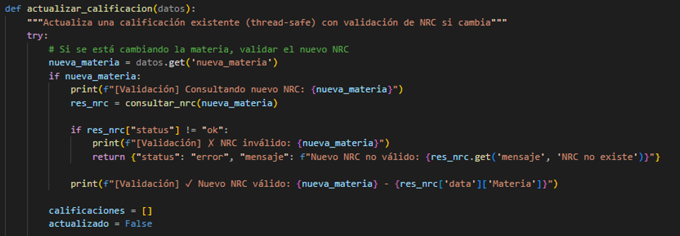

# Laboratorio 2 - Aplicaciones Distribuidas 
## Sistema de Gestión de Calificaciones 

Sistema cliente-servidor que permite gestionar calificaciones de estudiantes mediante sockets TCP. Implementado en dos versiones: sin hilos (un cliente) y con hilos (múltiples clientes).

---

## Estructura del Proyecto

```
Laboratorio_2/
├── sin_hilos/
│   ├── server.py                 # Servidor sin threading (1 cliente)
│   └── client.py                 # Cliente para servidor sin hilos
│   └── calificaciones.csv        # Archivo CSV para almacenar calificaciones (versión sin hilos)
│   
│
├── con_hilos/
│   ├── server.py                 # Servidor con threading (múltiples clientes)
│   ├── client.py                 # Cliente para servidor con hilos
│   └── calificaciones_hilos.csv  # Archivo CSV para almacenar calificaciones (versión con hilos)
│    
│── nrcs_server.py                # Servidor de validación de NRCs
│
│── nrcs.csv                      # Base de datos de NRCs válidos
│
└── README.md                     # Documentación del proyecto
```

---

## Características

### Versión SIN HILOS (`sin_hilos/`)
- **Puerto:** 5000
- **Capacidad:** 1 cliente a la vez
- **Modelo:** Secuencial/Bloqueante
- **Archivo:** `calificaciones.csv`
- **Validación NRC:** No implementada

### Versión CON HILOS (`con_hilos/`)
- **Puerto:** 5001
- **Capacidad:** Múltiples clientes simultáneos
- **Modelo:** Concurrente con threading
- **Archivo:** `calificaciones_hilos.csv`
- **Validación NRC:** ACTIVA (consulta servidor en puerto 12346)

### Servidor de NRCs (`nrcs_server.py`)
- **Puerto:** 12346
- **Función:** Validar códigos NRC de materias
- **Archivo:** `nrcs.csv`
- **Comandos:**
  - `LISTAR` - Lista todos los NRCs disponibles
  - `BUSCAR|<NRC>` - Valida un NRC específico

---

## Funcionalidades (CRUD)

| Operación | Descripción | Validación NRC (con_hilos) |
|-----------|-------------|---------------------------|
| **Agregar** | Registrar nueva calificación (ID, Nombre, NRC, Nota) | SI |
| **Listar** | Mostrar todas las calificaciones | NO |
| **Buscar** | Buscar calificaciones por ID de estudiante | NO |
| **Actualizar** | Modificar calificación y/o cambiar NRC | SI (si cambia NRC) |
| **Eliminar** | Eliminar registro de calificación | NO |

---

## Instrucciones de Ejecución

### Servidor SIN HILOS

**Terminal 1 - Servidor:**
```bash
cd sin_hilos
python server.py
```

**Terminal 2 - Cliente:**
```bash
cd sin_hilos
python client.py
```

### Servidor CON HILOS (con validación de NRCs)

**IMPORTANTE:** Debe iniciarse en este orden:

**Terminal 1 - Servidor de NRCs (PRIMERO):**
```bash
python nrcs_server.py
```
*Salida esperada: `[*] Servidor de NRCs escuchando en 127.0.0.1:12346`*

**Terminal 2 - Servidor de Calificaciones:**
```bash
cd con_hilos
python server.py
```
*Salida esperada: `[*] Validación de NRCs: ACTIVA (puerto 12346)`*

**Terminales 3, 4, 5... - Clientes:**
```bash
cd con_hilos
python client.py
```
*Puedes abrir múltiples clientes simultáneamente*

---

## Protocolo de Comunicación

### Formato JSON

**Comando del cliente (Agregar con NRC válido):**
```json
{
  "accion": "agregar",
  "datos": {
    "id": "001",
    "nombre": "Juan Pérez",
    "materia": "MAT101",
    "calificacion": "95"
  }
}
```

**Respuesta del servidor (éxito):**
```json
{
  "status": "success",
  "mensaje": "Calificación agregada correctamente (NRC: MAT101 - Matemáticas I)"
}
```

**Respuesta del servidor (NRC inválido):**
```json
{
  "status": "error",
  "mensaje": "NRC no válido: NRC no existe en la base de datos"
}
```

**Respuesta del servidor (Servidor NRC caído):**
```json
{
  "status": "error",
  "mensaje": "Error: Servidor de NRCs no disponible"
}
```

---

## Arquitectura de Microservicios (Parte 2)

```
┌─────────────┐         ┌──────────────────────┐         ┌─────────────────┐
│   Cliente   │────────>│  Servidor de         │────────>│  Servidor de    │
│             │  JSON   │  Calificaciones      │ BUSCAR  │  NRCs           │
│  (Puerto    │         │  (Puerto 5001)       │ |NRC|   │  (Puerto 12346) │
│   client)   │<────────│                      │<────────│                 │
└─────────────┘  JSON   │  - CRUD Operaciones  │  JSON   │  - Validación   │
                        │  - Thread-safe       │         │  - nrcs.csv     │
                        │  - calificaciones_   │         └─────────────────┘
                        │    hilos.csv         │
                        └──────────────────────┘
```

### NRCs Válidos Disponibles

| NRC | Materia |
|-----|---------|
| MAT101 | Matemáticas I |
| MAT102 | Matemáticas II |
| FIS101 | Física I |
| FIS102 | Física II |
| QUI101 | Química I |
| PRG101 | Programación I |
| PRG102 | Programación II |
| BDD101 | Base de Datos I |
| RED101 | Redes I |
| SOP101 | Sistemas Operativos |

---

## Comparación Entre Versiones

| Característica | Sin Hilos | Con Hilos |
|---|---|---|
| **Clientes simultáneos** | 1 | Múltiples |
| **Puerto** | 5000 | 5001 |
| **Concurrencia** | No | Sí |
| **Thread-safe** | N/A | Sí (locks) |
| **Validación NRC** | No | Sí |
| **Escalabilidad** | Baja | Alta |

---

## Rúbrica de Evaluación y Evidencias


##  Parte 1 — Funcionalidad Básica

###  Servidor y cliente sin hilos 
  
El servidor se levanta correctamente en modo secuencial, escuchando en el puerto configurado y esperando conexiones de clientes. Así mismo el cliente puede ver el menú funcionando correctamente y realizando las operaciones.

Se cumple el levantamiento correcto sin hilos; pruebas de
menú (agregar/buscar/listar) funcionan; CSV persiste datos. Evidencia en logs.

###  Cliente con hilos 
  
Se demuestra el correcto funcionamiento del servidor CON HILOS escuchando en 127.0.0.1:5001 y esperando conexiones de clientes.

###  Múltiples clientes conectados simultáneamente
  
Se observan dos clientes conectados al mismo tiempo sin bloqueos, confirmando la ejecución concurrente y listos para realizar sus operaciones según el menú desplegado.

###  Persistencia en archivo CSV
  
El archivo `calificaciones.csv` mantiene los datos agregados después de la ejecución, demostrando persistencia y correcto manejo de almacenamiento.

---

## Demostración de Escalabilidad

###  Servidor con hilos activo
  
El servidor multihilo se levanta correctamente y queda a la escucha de múltiples clientes en paralelo.

Se observan varios clientes conectados al mismo tiempo sin bloqueos, confirmando la ejecución concurrente y se realizó los casos de prueba correspondientes para verificar su correcto funcionamiento.

##  Parte 2 — Extensión con Servidor de NRCs (ComunicaciónInter-Servidores)

###  Código completo del servidor NRC
El servidor de NRCs maneja un archivo nrcs.csv con columnas: NRC, Materia.
El servidor de calificaciones consulta vía socket (puerto 12346) antes de agregar o actualizar.

  
El archivo `nrcs_server.py` implementa un servidor independiente que gestiona códigos de NRC con comandos `LISTAR` y `BUSCAR`.  
Incluye manejo de sockets, archivos CSV y modularidad en funciones (`listar_nrcs`, `buscar_nrc`, `procesar_comando`).


###  Servidor NRC en ejecución
  
Servidor funcionando y respondiendo correctamente a los comandos.

En los logs se evidencia la creación de varios hilos, lo que demuestra la atención paralela de peticiones.

 **Análisis de limitaciones:**  
Aunque el servidor soporta múltiples clientes en paralelo, podrían presentarse *race conditions* si varios hilos acceden al archivo CSV simultáneamente.  
Se sugiere el uso de `threading.Lock()` (ya implementado) para garantizar exclusión mutua.


###  Modificar el Servidor Concurrente de Calificaciones
Se realiza la modificación del Servidor Principal: Integración: Consulta NRC antes de registrar/actualizar; rechazo si inválido; manejo de fallos en conexión (except). Mantiene concurrencia.

 

Esta imagen muestra la función consultar_nrc(nrc)
Ahí se ve que el servidor principal se conecta al servidor de NRCs y maneja errores de conexión (socket.timeout, ConnectionRefusedError, Exception).
Demuestra la integración y manejo de fallos.


### Validación del NRC antes de registrar 

Muestra la función agregar_calificacion(), donde se llama a consultar_nrc(nrc) antes de escribir en el CSV.
Ahí se valida el NRC y se rechaza si no es válido.

 

Eso demuestra que el servidor consulta al NRC Server y rechaza si es inválido.

  
## Validación al actualizar calificación

###  Modificación de la función actualizar_calificación para validar el NRC.
  
En la función actualizar_calificación se modificó para que se valide el nuevo NRC antes de guardar cambios.

---
## Flujo del sistema

El servidor principal consulta al servidor de NRCs antes de registrar o actualizar calificaciones.
Si el NRC no existe, se rechaza la operación.
Además, se maneja correctamente la concurrencia mediante threading.Lock() y excepciones para fallos de conexión (timeout, ConnectionRefusedError).

## Análisis y Reflexión

Durante el desarrollo del laboratorio se implementaron dos servidores interconectados:
uno principal que gestiona calificaciones y otro auxiliar que valida los NRCs.
El principal desafío fue la comunicación entre servidores mediante sockets TCP, ya que se requería que el servidor principal consulte al servidor NRC antes de registrar o actualizar calificaciones.


También fue necesario manejar errores de conexión, por ejemplo cuando el servidor de NRCs no estaba disponible, implementando bloques try-except con mensajes de error claros.
Otro reto fue mantener la concurrencia segura, utilizando threading y Lock para evitar conflictos en el acceso al archivo CSV cuando varios clientes escriben simultáneamente.

---


## Lecciones Aprendidas (relación con CAP)

Este laboratorio permitió comprender la teoría CAP en sistemas distribuidos:

Consistencia (C): ambos servidores deben manejar la misma información válida de NRCs.

Disponibilidad (A): el sistema sigue funcionando aunque el servidor de NRCs falle, gracias al manejo de excepciones.

Tolerancia a particiones (P): si se interrumpe la conexión entre servidores, el principal no colapsa, sino que informa el error al cliente.

De esta forma, el diseño implementado logra un balance entre consistencia y disponibilidad, priorizando la robustez y la integridad de los datos.

## Requisitos

- Python 3.6+
- Módulos: `socket`, `csv`, `json`, `os`, `threading` (estándar)

---

## Casos de Prueba

### Parte 1: Sin Hilos
1. Iniciar servidor sin hilos (puerto 5000)
2. Conectar 1 cliente → Realizar operaciones CRUD
3. Intentar conectar 2º cliente → Quedará en espera hasta que el primero se desconecte

### Parte 2: Con Hilos + Validación NRC

#### Prueba 1: NRC Válido
1. Iniciar servidor de NRCs (puerto 12346)
2. Iniciar servidor de calificaciones (puerto 5001)
3. Conectar cliente y agregar calificación con NRC válido (ej. MAT101)
4. **Resultado esperado:** ✓ "Calificación agregada correctamente (NRC: MAT101 - Matemáticas I)"

#### Prueba 2: NRC Inválido
1. Con ambos servidores activos
2. Intentar agregar calificación con NRC inválido (ej. ABC999)
3. **Resultado esperado:** ✗ "NRC no válido: NRC no existe en la base de datos"

#### Prueba 3: Concurrencia
1. Conectar 3-5 clientes simultáneamente
2. Cliente A: Agregar con MAT101
3. Cliente B: Agregar con FIS101
4. Cliente C: Listar calificaciones
5. **Resultado esperado:** Todos los clientes operan sin interferencia

#### Prueba 4: Servidor NRC Caído
1. Detener servidor de NRCs (Ctrl+C)
2. Intentar agregar calificación desde cliente
3. **Resultado esperado:** ✗ "Error: Servidor de NRCs no disponible"

#### Prueba 5: Actualizar con Cambio de NRC
1. Actualizar calificación existente
2. Seleccionar cambiar NRC
3. Ingresar nuevo NRC válido (ej. PRG101)
4. **Resultado esperado:** ✓ "Calificación actualizada correctamente (Nuevo NRC: PRG101 - Programación I)"

---

**Laboratorio 2 - Aplicaciones Distribuidas**
